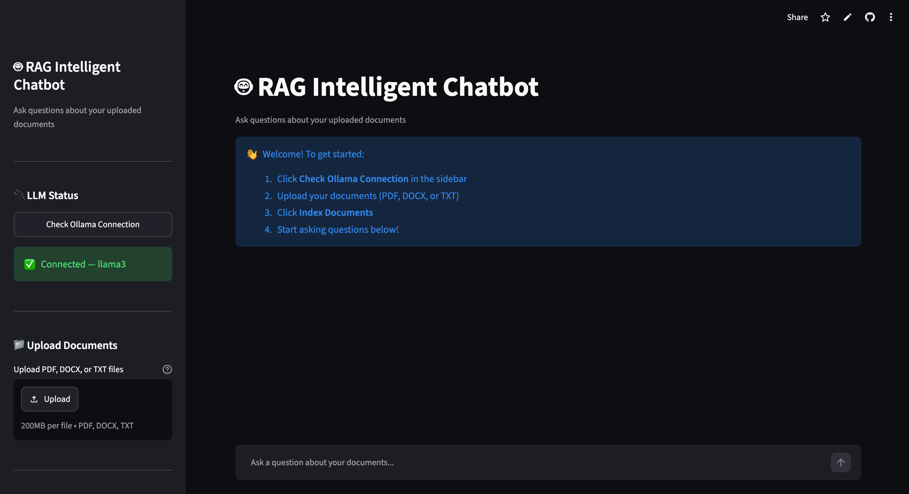
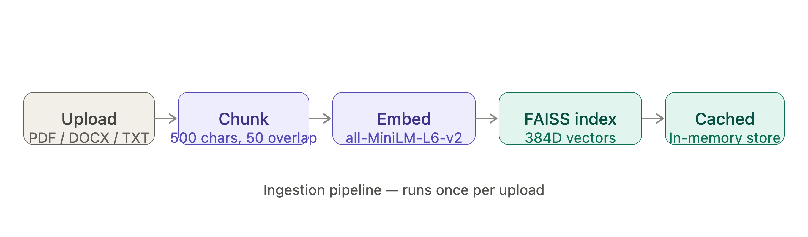
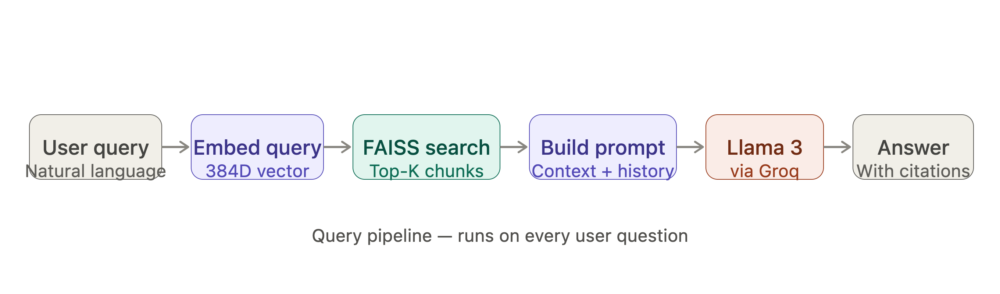

# 🤖 RAG-Based Intelligent Chatbot

## 🚀 Overview

An AI-powered document assistant that uses Retrieval-Augmented Generation (RAG) to answer questions grounded in your own documents. Upload any PDF, DOCX, or TXT file — the system indexes it into a vector database and uses Llama 3 to generate accurate, cited answers. Zero hallucination, page-level source citations, and multi-turn conversation memory.

🔗 **Live Demo → [rag-chatbot-2509.streamlit.app](https://rag-chatbot-2509.streamlit.app)**

## 📸 App Preview



## 🎯 Features

✅ **Multi-format document ingestion** — supports PDF, DOCX, and TXT files  
🔍 **Semantic search** — finds relevant content by meaning, not keywords  
📎 **Source citations** — every answer cites the exact document and page number  
➕ **Incremental indexing** — add new documents without wiping existing ones  
💬 **Multi-turn memory** — conversation history included in every prompt  
⚡ **In-memory cache** — FAISS index loaded once, reused across all queries  
🧠 **Context budget** — automatic truncation prevents context window overflow  
☁️ **Cloud LLM** — Llama 3 via Groq API (fast, free tier available)  

## 🏗️ Tech Stack

🔹 **Python** — Core development language  
🔹 **Streamlit** — Interactive web application frontend  
🔹 **LangChain** — Document loaders, text splitters, memory management  
🔹 **Sentence Transformers** — all-MiniLM-L6-v2 for 384D embeddings  
🔹 **FAISS** — Vector database for fast similarity search  
🔹 **PyMuPDF** — PDF parsing with page-level metadata  
🔹 **python-docx** — Word document parsing  
🔹 **Groq API + Llama 3** — Cloud-hosted LLM for response generation  

## 🔄 How It Works

### Ingestion Pipeline — runs once per upload



### Query Pipeline — runs on every question



## 📦 Installation

Clone the repository and install dependencies:

```bash
git clone https://github.com/gazalyadav/rag-chatbot.git
cd rag-chatbot
python -m venv venv
source venv/bin/activate      # macOS/Linux
# venv\Scripts\activate       # Windows
python -m pip install -r requirements.txt
```

Create a `.env` file in the project root:
GROQ_API_KEY=your_groq_api_key_here

Get a free Groq API key at [console.groq.com](https://console.groq.com)

## ▶️ Running the App

```bash
python -m streamlit run app.py
```

Open your browser at `http://localhost:8501`

## 📑 File Structure
```
rag_chatbot/
├── app.py                  # Streamlit UI entry point
├── requirements.txt        # Python dependencies
├── .env                    # API keys (never commit this)
├── src/
│   ├── config.py           # Central configuration & parameters
│   ├── document_loader.py  # PDF, DOCX, TXT parsing with metadata
│   ├── text_splitter.py    # Chunking logic (500 chars, 50 overlap)
│   ├── embeddings.py       # Sentence Transformer wrapper + cache
│   ├── vector_store.py     # FAISS index + in-memory cache
│   ├── retriever.py        # Top-K similarity search
│   ├── prompt_builder.py   # RAG prompt template + context budget
│   ├── llm_handler.py      # Groq / Ollama LLM interface
│   ├── memory_manager.py   # Conversation window memory
│   └── rag_chain.py        # End-to-end RAG orchestrator
└── tests/
    └── test_pipeline.py    # Smoke tests + pipeline validation
```

## 🏆 How It Works — Step by Step

1. **Upload documents** — drag and drop PDF, DOCX, or TXT files into the sidebar
2. **Index documents** — click ⚡ Index to chunk, embed, and store in FAISS
3. **Ask questions** — type any question about your documents in the chat box
4. **Get cited answers** — Llama 3 responds with [Source N] citations showing the exact page
5. **Multi-turn chat** — ask follow-up questions; conversation history is included in every prompt
6. **Add more documents** — use "Add to existing index" to grow your knowledge base without wiping previous uploads

## 🚀 Future Enhancements

📌 **RAGAS Evaluation** — automated faithfulness and relevancy scoring  
🔍 **Hybrid Search** — combine semantic + keyword search for better recall  
📊 **Usage Analytics** — track query patterns and document coverage  
🔐 **Multi-user Support** — separate vector stores per user session  
🌐 **URL Ingestion** — scrape and index web pages directly  
📱 **Mobile UI** — responsive design for phone and tablet use  

## 🤝 Contributing

Contributions are welcome! Feel free to fork this repository, create a new branch, and submit a pull request.

## 🔗 License

MIT License — Free to use and modify.

---
